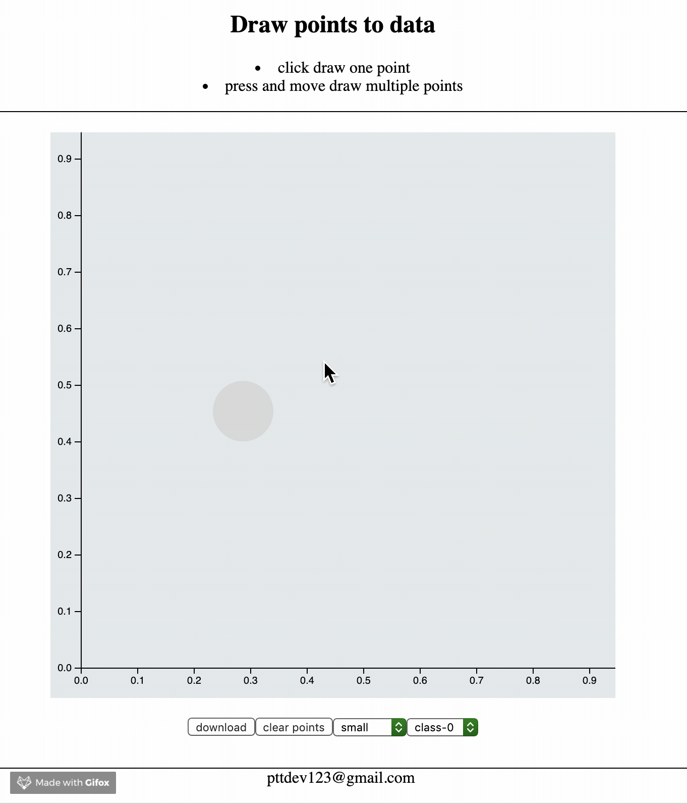

### Draw2Data

#### Motivation

I am studying data science. It is common that there are special dataset
can 'break' some algorithms. Unfortunately, often only figures are provided.
For those special dataset, it is not intuitively generate by math library
but it is much easier by drawing them. The purpose of this tiny application
is for helping people generate dataset and download as csv file.

#### Installation

no installation required, clone the repo, then using any favorate browser
open index.html file, that's all!

#### Note

- data are normalize in range 0, 1
- current only have 5 labels/classes, if need more classes, just edit index.js file
